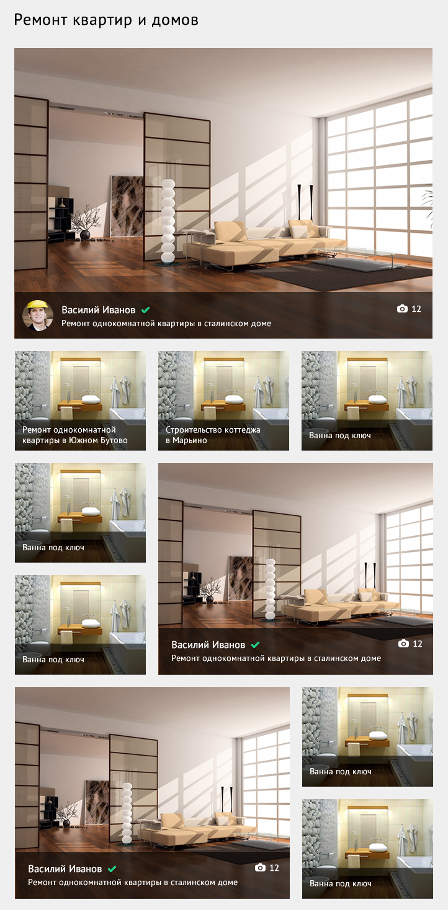

# Условия

Суть задачи: построить сетку из однородного списка, согласно отображению на макете.
Использование angularjs — обязательно.
Результат нужно выложить на github или bitbucket.
Перед выполнением задачу необходимо оценить.

# Описание API

Точка API: https://staging.remontnik.ru/api/v1/portfolio/all/

В поле results приходит массив объектов фото работ.
Каждый из элементов сетки — один из этих объектов.

Поля объекта:

- images — массив с объектами с изображениями разного размера (берем первый для отображения);
- contractor — данные мастера;
- title — заголовок работы;
- images.length — количество изображений в элементе сетки (цифра рядом с иконкой фотоаппарата);
- contractor.is_documents_confirmed — флаг верификации документов (зеленая галочка рядом с именем мастера).

## Старт проекта
---
* Введите команду `npm start`:
* Если не открылось автоматически то откройте вручную [`http://localhost:3001/`](http://localhost:3001/).
